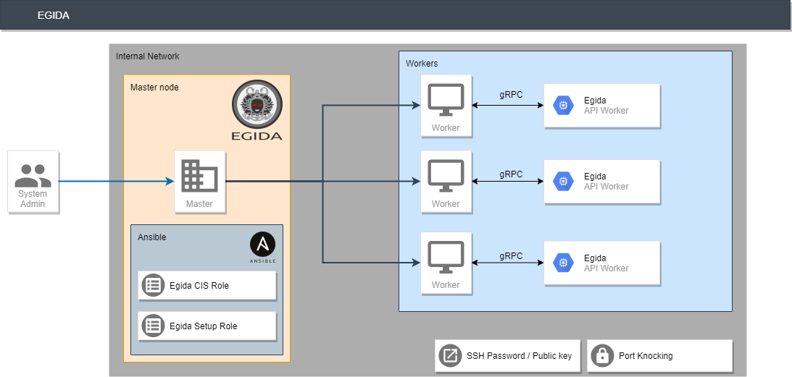

# Egida

<!-- PROJECT SHIELDS -->

<!-- PROJECT LOGO -->

 

  

  

     
    <a href="https://egida-kassandra.github.io/egida/"><strong>Explore the docs »</strong></a>
     
  

<!-- TABLE OF CONTENTS -->
## Table of Contents

* [Overview](https://antonioalfa22.github.io/egida/#overview)
* [Installation](https://antonioalfa22.github.io/egida/#installation)
  * [Prerequisites](https://antonioalfa22.github.io/egida/#prerequisites)
  * [Download and install](https://antonioalfa22.github.io/egida/#download-and-install)
* [Getting Started](https://antonioalfa22.github.io/egida/#getting-started)
  * [Create and delete host groups](https://antonioalfa22.github.io/egida/#create-and-delete-host-groups)
  * [Show host info](https://antonioalfa22.github.io/egida/#show-host-info)
  * [Hardening Menu](https://antonioalfa22.github.io/egida/#hardening-menu))
* [Hardening](https://antonioalfa22.github.io/egida/#hardening)
  * [All CIS Benchmarks](https://antonioalfa22.github.io/egida/#all-cis-benchmarks)
  * [CIS Points](https://antonioalfa22.github.io/egida/#cis-points)
  * [CIS Sections](https://antonioalfa22.github.io/egida/#cis-sections)
  * [CIS Controls](https://antonioalfa22.github.io/egida/#cis-controls)
  * [Hardening Variables](https://antonioalfa22.github.io/egida/#hardening-variables)
* [License](https://antonioalfa22.github.io/egida/#license)
* [Contact](https://antonioalfa22.github.io/egida/#contact)

<!-- Overview -->
---
## Overview

The Egida project is a server orchestration system that allows to perform and deploy security configurations 
(custom control lists) over a machine infrastructure. These security configurations can shield and protect those 
servers by implementing the desired security measures depending on the server profile. Controls are sourced from the 
[CIS Benchmarks](https://www.cisecurity.org/cis-benchmarks/), and we also need to obtain system information about each 
of the deployed servers to ensure proper deployment.

To achieve that, Egida is built using a microservices-based architecture composed of the following three modules:

- **egida**: This is the main module, in charge of providing the communication interfaces with the user, as well as the 
         process of the specific domain language called Aspida. Using this module, the user can define 
         the different profiles to work with and the actions to be performed.
         
- **egida-roles**: This module contains the definition of the Ansible roles that contains the actions corresponding to 
        the security controls that are defined for each profile that a machine may have assigned. These actions can be 
        either hardening operations (CIS Benchmarks) or setup actions to prepare that machine so it can be 
        used correctly by Egida.
        
- **egida-api**: The functionality of this module is to provide information of each machine to be used by Egida. 
        This information can be varied: the services that are currently running, the operating system version or the 
        score obtained with the [Lynis](https://cisofy.com/lynis/) tool… any kind of information that we determine it is 
        interesting to better deploy any security control. 

<!-- LICENSE -->
## License

Distributed under the Apache 2.0 License. See `LICENSE` for more information.

<!-- CONTACT -->
## Contact

Authors:

* [Antonio Payá González](https://antoniopg.tk)
* [Alba Cotarelo Tuñón](https://antoniopg.tk)
* [Jose Manuel Redondo Lopez](http://orcid.org/0000-0002-0939-0186)

Project Link: [https://github.com/antonioalfa22/egida](https://github.com/antonioalfa22/egida)
