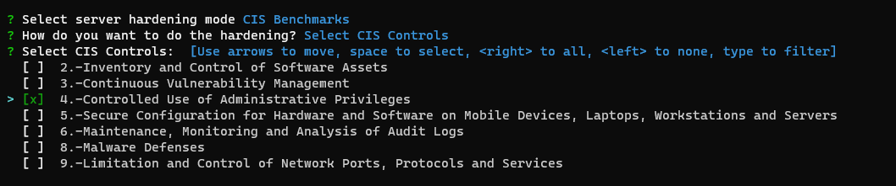

# Egida Project

<!-- PROJECT SHIELDS -->
[](https://github.com/antonioalfa22/egida)
[](https://github.com/antonioalfa22/egida/blob/master/LICENSE)
[](https://github.com/antonioalfa22/egida/releases)

<!-- PROJECT LOGO -->

<br />
<div align="center">
  <a href="https://github.com/antonioalfa22/egida">
    
  </a>

  <p align="center">
    <br />
    <a href="https://github.com/antonioalfa22/egida">View Source</a>
    ·
    <a href="https://github.com/antonioalfa22/egida/issues">Report Bug</a>
    ·
    <a href="https://github.com/antonioalfa22/egida/issues">Request Feature</a>
  </p>
</div>


<!-- TABLE OF CONTENTS -->
## Table of Contents

* [Overview](#overview)
* [Installation](#installation)
  * [Prerequisites](#prerequisites)
  * [Download and install](#download-and-install)
* [Getting Started](#getting-started)
  * [Environment SetUp](#environment-setup)
  * [Add Host](#add-host)
  * [Variables](#variables)
* [Hardening](#hardening)
  * [All CIS Benchmarks](#all-cis-benchmarks)
  * [CIS Points](#cis-points)
  * [CIS Sections](#cis-sections)
  * [CIS Controls](#cis-controls)
* [Getting Info](#getting-info)
  * [Lynis Score](#lynis-score)
  * [Machine Info](#machine-info)
* [License](#license)
* [Contact](#contact)

<!-- Overview -->
---
## Overview

The Egida project is a server orchestration system that allows to perform and deploy security configurations 
(custom control lists) over a machine infrastructure. These security configurations can shield and protect those 
servers by implementing the desired security measures depending on the server profile. Controls are sourced from the 
[CIS Benchmarks](https://www.cisecurity.org/cis-benchmarks/), and we also need to obtain system information about each 
of the deployed servers to ensure proper deployment.

To achieve that, Egida is built using a microservices-based architecture composed of the following three modules:


- **egida**: This is the main module, in charge of providing the communication interfaces with the user, as well as the 
         process of the specific domain language called Aspida. Using this module, the user can define 
         the different profiles to work with and the actions to be performed.
         
- **egida-roles**: This module contains the definition of the Ansible roles that contains the actions corresponding to 
        the security controls that are defined for each profile that a machine may have assigned. These actions can be 
        either hardening operations (CIS Benchmarks) or setup actions to prepare that machine so it can be 
        used correctly by Egida.
        
- **egida-api**: The functionality of this module is to provide information of each machine to be used by Egida. 
        This information can be varied: the services that are currently running, the operating system version or the 
        score obtained with the [Lynis](https://cisofy.com/lynis/) tool… any kind of information that we determine it is 
        interesting to better deploy any security control. 


<!-- Installation -->
---
## Installation

### Prerequisites

Egida v1.0.0 requires the following software to be installed on the master node:

> Currently, Egida v1.0.0 needs an Ubuntu >=18.04 LTS OS.

- **Ansible >2.8**: [Install Ansible](https://docs.ansible.com/ansible/latest/installation_guide/index.html)

```commandline
sudo apt update
sudo apt install software-properties-common
sudo apt-add-repository --yes --update ppa:ansible/ansible
sudo apt install ansible
```

- **Python 3.x**: [Install Python 3](https://www.python.org/downloads/)
```commandline
sudo apt update
sudo apt install software-properties-common
sudo add-apt-repository ppa:deadsnakes/ppa
sudo apt install python3.7
sudo apt install python3-pip
```

> At this point, Python 3.7 is installed on your Ubuntu system and ready to be used. You can verify it by typing
> `python3.7 --version`

- **unzip**: Install Unzip
```commandline
sudo apt install unzip
```

### Download and install

In order to install the Egida core you have to follow the instructions below.

```commandline
wget https://github.com/antonioalfa22/egida/releases/download/1.0.3/install.sh
sudo chmod +x install.sh
sudo ./install.sh
```


<!-- Getting Started -->
---
## Getting Started

Once Egida has been successfully installed, you must follow the following steps in order to run it correctly:

### Environment SetUp

The preparation of the environment is necessary to customize the execution of Egida to your restrictions.

#### Hosts

**Add hosts group**: To add a new hosts group you have to follow these steps:

```commandline
sudo egida config -g [Group Name] --hosts [Host1 Host2 ... HostN]
```

> **Example**: `sudo egida config -g servers --hosts localhost 192.168.0.11 192.168.0.12`

> **Localhost Example**: `sudo egida config -g servers --hosts localhost`

> Currently, editing groups is not implemented, if you want to add or remove hosts to a group you must edit the hosts file located in /etc/ansible/hosts

#### Variables

Many of the operations require data which, depending on the type of installation, can be variable (e.g. user names, passwords, etc.).


To edit these variables there is a template located in _/etc/egida/custom/vars_template.yml_

Any YAML file whose name begins with **vars_** located in the _/etc/egida/custom_ folder will be considered as a possible configuration of 
variables that can be selected at the hardening time.
 
> It is recommended to **never delete** the file **vars_template.yml** as it contains the appropriate syntax and all the necessary variables.

**vars_template.yml**:

```yaml
# defaults file for cis

###############################################
# Values which modify the behaviour of the role
###############################################

run_all_level_1: true    # Whether Level 1 of the benchmark should be applied
run_all_level_2: true    # Whether Level 2 of the benchmark should be applied

# extras: true              # Check if want extras

cis_level_1_exclusions: []         # A list of Level 1 recommendations to exclude (i.e. ['1.1.1.1'])
cis_level_2_exclusions: []         # A list of Level 2 recommendations to exclude


###############################################
# Check specific values which can be overridden
###############################################

# ======== 1. Initial Setup ===================

# 1.3.2 AIDE cron settings

aide_cron:
  cron_user: root
  cron_file: /etc/crontab
  aide_job: '/usr/bin/aide.wrapper --check'
  aide_minute: 0
  aide_hour: 5
  aide_day: '*'
  aide_month: '*'
  aide_weekday: '*'

# 1.4.2 GRUB Password
grub_pass: antonio

# 1.4.3 root Password
root_pass: antonio

# ======== 3. Network configuration ===================

# 3.4.2 Host allow
host_allow:
  - "10.0.0.0/255.0.0.0"
  - "172.16.0.0/255.240.0.0"
  - "192.168.0.0/255.255.0.0"

# 3.5.2.1 UFW

ufw_ports_allow: ['22']
ufw_deny_outgoing: false

# ======== 4. Logging and auditing ===================
default_auditd: true  # Copy auditd template


# ======== 5. SSH Server Configuration ===================

sshd_access:
  ssh_port: 372
  allowusers: antonio
  # allowgroups: systems dba
  # denyusers:
  # denygroups:

# 5.3.1  Ensure password creation
pwquality:
  - key: 'minlen'
    value: '14'
  - key: 'dcredit'
    value: '-1'
  - key: 'ucredit'
    value: '-1'
  - key: 'ocredit'
    value: '-1'
  - key: 'lcredit'
    value: '-1'

# 5.4.1.1 Password

password:
  max_days: 365
  min_days: 7
  warn_age: 7
  inactive: 30


# ======== EXTRAS ===================
nameservers: [8.8.8.8, 8.8.4.4]
```

<!-- Hardening -->
---
## Hardening

At this moment only the **console menu** hardening option is developed.
The option using a DSL (Domain Specific Language) is under development.

To start using Egida you must run it as follows:

```shell script
sudo egida [-h] [--file FILE] [-g GROUP] [-c CONNECTION] [-H HOSTS ...] [-a] mode
```

**Positional arguments:**
- _mode:_ EGIDA Mode \[menu | compile | config | info\]

**Optional arguments:**
- **_-h, --help_**: Show help
- **_--file_**: Aspida (DSL) file (Not implemented yet)
- **_-g GROUP, --group GROUP_**: Host group
- **_-c CONNECTION, --connection CONNECTION_**: Connection type (default local): local | ssh
- **_-a, --audit_**: Audit hosts with lynis (Needs egida-api-worker)

**Localhost Example:**
```shell script
sudo egida menu
```


At this moment, only the CIS Benchmarks based hardening option is available, 
but in future versions the option of LAMP and LEMP specialized hardening will be added.

### All CIS Benchmarks
This option will perform all the controls of the CIS Benchmarks except those ones included 
in the variables _cis_level_1_exclusions_ and _cis_level_2_exclusions_ defined in the variables file.

### CIS Points


This option will perform all the selected points of the CIS Benchmarks.
You can use _up_, _down_ to move, _space_ to select, _a_ to toggle, _i_ to invert.

### CIS Sections


This option will perform all the selected sections of the CIS Benchmarks.
You can use _up_, _down_ to move, _space_ to select, _a_ to toggle, _i_ to invert.

### CIS Controls


This option will perform all the selected controls of the CIS Benchmarks.
You can use _up_, _down_ to move, _space_ to select, _a_ to toggle, _i_ to invert.

### Hosts and Templates


In this menu you can select which file of variables you want to use and which hosts group.

**Once selected, the hardening options will begin.**

<!-- Getting info -->
---
## Getting Info

Not implemented yet.


<!-- LICENSE -->
---
## License

Distributed under the Apache 2.0 License. See `LICENSE` for more information.

<!-- CONTACT -->
---
## Contact

Authors:

* [Antonio Payá González](https://antoniopg.tk)
* [Alba Cotarelo Tuñón](https://antoniopg.tk)
* [Jose Manuel Redondo Lopez](http://orcid.org/0000-0002-0939-0186)

Project Link: [https://github.com/antonioalfa22/egida](https://github.com/antonioalfa22/egida)


